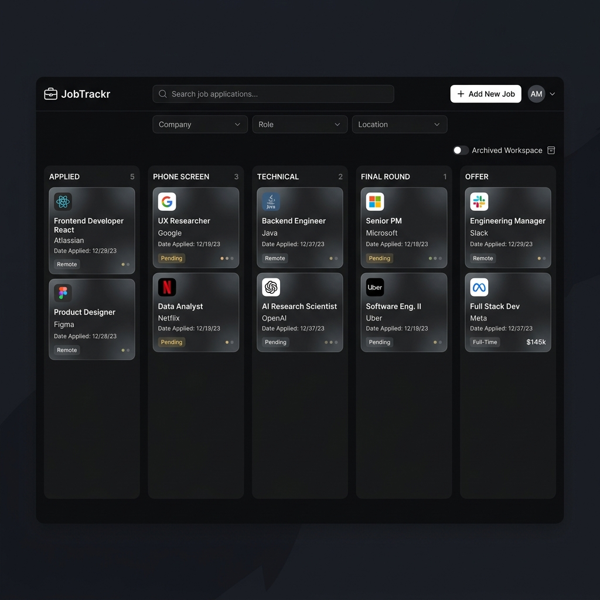
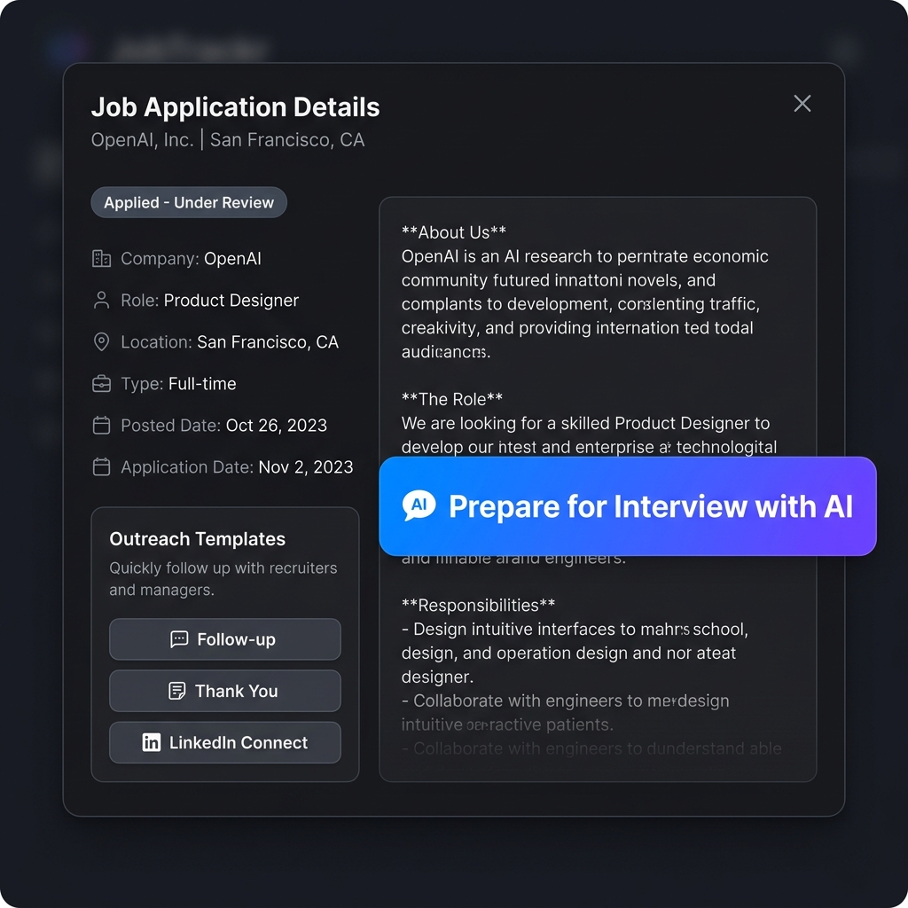

# JobTrackr — Intelligent Chrome Extension for Job Hunters

JobTrackr is a Manifest V3 Chrome Extension designed to automate the job application lifecycle. It runs fully client-side to protect your privacy—requiring no servers, no external accounts, and no complex configuration. 

With JobTrackr, you can automatically capture submitted applications, parse resumes, auto-fill job application forms, generate tailored AI prompts for interviews/resume optimization, and manage your pipeline through an interactive dashboard.



---

## 🚀 Key Features

*   **⚡ Automatic Submission Detection:** Content scripts automatically identify application submissions on LinkedIn and other popular job portals. Once a submission is confirmed, it instantly logs or promotes the application status to **Applied**.
*   **📄 Client-Side Resume Parsing:** Upload **PDF** (via `pdf.js`) or **DOCX** (via `mammoth.js`) resumes directly. The extension parses skills, work experience, and personal details on the fly.
*   **📋 Form Auto-Filler:** Intuitively detects job form fields (Greenhouse, Lever, etc.) and offers a floating **"Auto-Fill Form"** button that injects your parsed resume details and highlights matching inputs.
*   **🤖 AI Resume & Prompt Helper:** Integrates with ChatGPT and Gemini to customize resumes, prepare for interviews, or write target cover letters with a single click.
*   **✉️ AI Outreach Template Generator:** Located in the details modal. Generates tailored, copyable follow-up, thank you, and LinkedIn connection scripts using candidate information and job metadata.
*   **🎯 AI Interview Prep Action:** Instantly compiles a structured technical and behavioral preparation prompt from the job description and your resume, launching it straight into ChatGPT or Gemini.
*   **📁 Archived Applications Workspace:** Allows moving closed or historic applications to a separate workspace via an "Archive" detail action, hiding them from your active pipeline while retaining them for statistics and salary metrics.
*   **🚫 Collapsible Rejected Applications with Count Badge:** A toggle button with an active badge counter dynamically shows or hides rejected applications on the dashboard and popup, keeping your active search pipeline focused.
*   **📊 Kanban & Table Dashboard:** Manage your entire pipeline in a full-screen dashboard equipped with a drag-and-drop Kanban board, fuzzy search, CSV/JSON import/export, and visual analytics.
*   **⏰ Automatic Follow-Up Alarms:** Background workers automatically monitor aging applications (default: 7 days) and push Chrome system notifications to remind you to follow up.

---

## 📁 Project Architecture & File Structure

JobTrackr is built on a modular design using Vanilla JS, HTML, and CSS without build frameworks:

```
jobtrackr/
├── manifest.json              # Extension setup, matches URL content scripts & permissions
├── CLAUDE.md                  # Developer guidelines and testing routines
├── serve.json                 # Static local server config
├── background/
│   └── service-worker.js      # Handles message passing, alarms, storage writes, and badge counts
├── content/
│   ├── detector.js            # Injected page-watcher detecting application status
│   ├── autofill.js            # Auto-fills job forms using parsed resume profile data
│   └── ai-filler.js           # Pre-fills prompts on ChatGPT and Gemini input textareas
├── storage/
│   ├── shared.js              # Single source of truth (Fuzzy deduping, settings defaults, scoring)
│   └── db.js                  # chrome.storage.local helper for CRUD and data migrations
├── popup/
│   ├── popup.html             # Compact UI modal (Stats, quick search, manual entry)
│   ├── popup.css
│   └── popup.js
├── dashboard/
│   ├── dashboard.html         # Full-page dashboard (Kanban, tables, detailed modals, skill gap analysis)
│   ├── dashboard.css
│   └── dashboard.js
├── resume/
│   └── resume-parser.js       # Client-side PDF/DOCX text parsing and profile extraction
├── utils/
│   └── helpers.js             # Date/time formatting, badge rendering, and utility functions
├── lib/                       # Third-party libraries loaded locally (No CDN requirement)
│   ├── lucide.min.js          # SVG Icon set
│   ├── mammoth.browser.min.js # Word document parsing
│   ├── pdf.min.js             # PDF text stream parser
│   └── pdf.worker.min.js
└── icons/                     # Brand icons (16px, 48px, 128px)
```

---

## 🛠 Installation & Setup

1.  **Download/Clone** the repository to your local machine.
2.  Open Google Chrome and navigate to `chrome://extensions/`.
3.  In the top-right corner, toggle **Developer mode** to **ON**.
4.  Click **"Load unpacked"** in the top-left menu.
5.  Select the `jobtrackr` directory (the folder containing the `manifest.json` file).
6.  The JobTrackr icon will appear in your extensions list. Pin it to the browser toolbar for quick access.

---

## 📖 Deep Dive: How It Works

### 1. Storage & Schema
All user data resides in `chrome.storage.local` within three core keys:
*   `jobtrackr_applications`: Array of application records.
*   `jobtrackr_resume`: Structured JSON representing your parsed resume.
*   `jobtrackr_settings`: User choices (Auto-detect toggles, EEO authorization profiles, and preferred AI configs).

#### Application Schema Details
```json
{
  "id": "uuid-v4",
  "jobTitle": "Full Stack Engineer",
  "company": "Tech Corp",
  "platform": "linkedin",
  "applicationUrl": "https://...",
  "location": "New York, NY",
  "jobType": "Full-time",
  "salary": "$120k - $140k",
  "dateFirstSeen": "2026-06-09T07:35:56Z",
  "dateApplied": "2026-06-09T07:38:12Z",
  "status": "Applied",
  "statusHistory": [
    { "status": "Applied", "date": "2026-06-09T07:38:12Z", "note": "Auto-detected application submission" }
  ],
  "jobDescription": "Full Job Description Text...",
  "notes": "",
  "detectedAutomatically": true,
  "createdAt": "2026-06-09T07:35:56Z",
  "updatedAt": "2026-06-09T07:38:12Z"
}
```

### 2. Intelligent Auto-Fill Engine
When navigating to an application form:
*   `content/autofill.js` runs on page load and checks for form input elements.
*   It matches input selectors against standard fields (First Name, Last Name, Email, Phone, Resume file input, etc.).
*   It matches custom questions (e.g. Work Authorization, Ethnicity, Gender) from the user's saved EEO settings profile.
*   Clicking **"Auto-Fill Form"** triggers native events (`input`, `change`, `blur`) to ensure modern frontend frameworks (React, Angular, Vue) pick up the injected data.

### 3. AI Copilot Integration
From the dashboard, you can open AI helpers:
*   JobTrackr bundles your resume data and the target job description.
*   It stores a transient prompt in `chrome.storage.local` under `jobtrackr_pending_ai` and launches ChatGPT or Gemini.
*   `content/ai-filler.js` intercepts the loaded AI chatbot window, locates the main text entry area, pastes the prompt template, and highlights the area.



### 4. Background Workers & Alerts
*   Alarms run daily to check for applications stuck in "Applied" state for longer than the threshold in your settings (default: 7 days).
*   Chrome system notifications are triggered. Clicking them redirects you to the Kanban board to manage follow-up messages.
*   A badge overlay on the extension icon reflects the current count of applications awaiting feedback.

---

## 🧪 Testing Features Locally

Refer to the testing guidelines detailed inside [CLAUDE.md](file:///d:/Practice/Claude/chrome%20extension%20JobTracker/jobtrackr/CLAUDE.md) for how to trigger Phase 1/Phase 2 detection, parse resumes, and export/import test CSV records.
